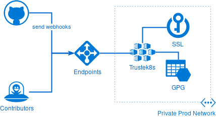
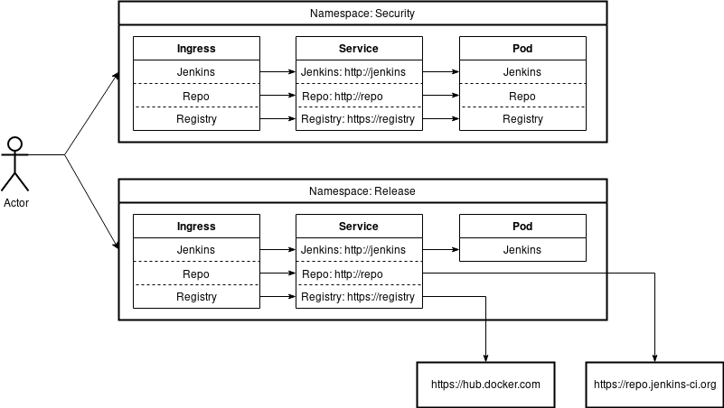

ifdef::env-github[]
:tip-caption: :bulb:
:note-caption: :information_source:
:important-caption: :heavy_exclamation_mark:
:caution-caption: :fire:
:warning-caption: :warning:
endif::[]

= IEP-12: Jenkins Release Management

:toc:

.Metadata
[cols="2"]
|===
| IEP
| 12

| Title
| Jenkins Release Management

| Author
| link:https://github.com/olblak[Olivier Vernin]

| Status
| :speech_balloon: In-process

| Type
| [Architecture]

| Created
| 2018-07-25
|===


== Abstract
In a matter of continuously improving Jenkins infrastructure project, it's now time to address how Jenkins is released and distributed.
Currently new version can only be signed and published by link:https://github.com/kohsuke[Kohsuke], which brings a lot of responsibilities on his shoulder and prevent the project to release new version when needed.
So the purpose of this document is to design a secure and clear way to allow trusted people to trigger a new release.

== Specification
As the jenkins project is build and driven by its community, we want to be as much transparent as possible in the way we build, test and release new versions and allow everybody to understand and provide reviews or audits. So the release process must be as much as possible automated and well-defined from git repositories.

Building, testing, releasing new jenkins version covers different topics which need be addressed in this document.

* Environment Provisioning
* Environment Configuration
* Environment Workflow

=== Provisioning
Obviously the first element to agree on, is where to run those environments and how to provision them.
Today, the Jenkins Infrastructure project mainly use an Azure account provisioned from some Terraform code located link:https://github.com/jenkins-infa/azure[here]. This repository make it easy for everybody to participate either by auditing, improving, or even simply learning. So we just have to decide on the services that we need there.

Before going further, we must clarify that while we try to be as open as possible, we still need to have some element well hardened, to avoid malicious person to abuse our systems or to steal private information like keys. To avoid this situation, we need two level of security accesses, one infrastructure reachable for all contributors to have quick feedback on test results and another one with limited access from the internet for either security contributors or the release officer.

As we are already running Jenkins master and agent in Docker containers with great success, we want to go further and use a container orchestration tool to deploy and configure our build environment. Kubernetes is an awesome tool and therefor selected to orchestrate our workload. We'll use the Azure Kubernetes service.

Another important element, is where is stored the gpg key and the ssl certificate.
Those two keys are used by maven release to generate signed artifacts.
They are what ensure that end user can trust our artifacts and therefor must be extremely well protected.

They are two approaches which have both benefits.


The first and the most convenient solution is to store every secret encrypted in a git repository and use a tool like link:https://github.com/mozilla/sops[sops] to unencrypt them when needed. This solution make it easy for everybody to audit secret modifications. The build environment only requires a GPG key to decrypt those secrets. This means that we don't need any additional infrastructure other than a Kubernetes cluster.


The second solution would be to deploy the GPG and the SSL certificate somewhere else not publicly available and reduce the access to specific networks.



The latter solution open the door to more secure but also more complex infrastructure and complexify the reproducibility of our build environment which is not necessarily needed for non-critical environment.

Both can be used depending on the environment.


This link:https://github.com/jenkins-infra/azure[PR] partially implements this design

=== Configuration
Now that our infrastructure provisioning is defined, we can look at how we'll configure and the benefit of using Kubernetes for such build environment.

Before going further, I want to remind some key features provided by Kubernetes that influence our design. First, every Kubernetes cluster has an internal DNS where each internal URL means a "service-name" inside a namespace or "service-name.namespace" across namespaces. This internal DNS make it easy to spin up multiple environment using the same internal endpoint.
Another powerful feature is that we can map internal endpoint with an external one.
This make the environment totally agnostic of where the services are located.

Let's come back to our environment configuration. Kubernetes in association with Helm makes it easy to deploy and configure all kind of services required to build test and publish in a very convenient way wherever the cluster is located Azure or even Minikube.
Most of the services that we need can already be deploy with Helm charts.

The big picture is to create an environment charts, one to rules them all.
This main chart is responsible to deploy jenkins credentials as Kubernetes secret, set a custom jenkins image with specific configuration and finally some chart dependencies to deploy third services (Artifactory,maven registry, ...)


For example, let's imagine two different environments, security and release.
The security environment generate short-live artifacts and so is configured to deploy every services needed to share those artifacts (maven, docker, war, etc.). It's easier to control the access, we don't pollute the official repository.
But in the case of the release environment, it doesn't make sense to deploy a maven repository behind maven.release.jenkins.io as we already have link:https://repo.jenkins-ci.org[repo.jenkins-ci.org]
So we just map http://repo with https://repo.jenkins-ci.org.

.Environment


Using Kubernetes as CI/CD environment is not only about how we deploy and configure Jenkins but how we deploy and configure all third services that we need.

This repository use Jenkins-x to configure an environment https://github.com/olblak/jenkins-release-environment. Jenkins-x is an opinionated way for configuring such environment on Kubernetes.

Following table display the different endpoints that we can use for each environment where the internal endpoint are the same for every environment.

[cols="h,3*", options="header"]
.Endpoint
|===
|       |  Repo | Jenkins | Registry
| Internal | http://repo | http://ci | http://registry
| Weekly | http://repo.weekly.jenkins.io | https://ci.weekly.jenkins.io | http://registry.weekly.jenkins.io
| Security | https://repo.cert.jenkins.io | https://ci.cert.jenkins.io | https://ci.registry.jenkins.io
| Release | https://repo.jenkins-ci.org | https://ci.release.jenkins.io | https://hub.docker.com
|===

=== Workflow
It's now time to cover the last topic, which is how we build, test and release a specific version for an environment. Jenkins is used as the conductor by means of Jenkinsfile and will execute a succession of actions defined link:https://github.com/olblak/jenkins/blob/master/Jenkinsfile.release[here].
In order to simplify the maintainability of this script, most of the logic as been moved to a shell link:https://github.com/olblak/jenkins/blob/master/scripts/buildJenkins.bash[script] that accept various arguments.

All endpoints are hard-coded with Kubernetes internal endpoint like "repo", jenkins, ... And any other configuration is done via environment variables configured at the environment level.
So every environment use the same Jenkinsfile but the output change depending on the environment configuration and the git repository.

Maven with the link:http://maven.apache.org/maven-release/maven-release-plugin/[release plugin] is used to build Jenkins(link:https://wiki.jenkins.io/pages/viewpage.action?pageId=3309681[why?]).

So in order to successfully build the application, we must:

****
. Retrieve the GPG key.
. Retrieve the private/public SSL certificate.
. Retrieve password to unlock the gpg key and the certificate from Azure Key Vault.
. Prepare the release with Maven ```mvn release:prepare```
. Perform the release with Maven ```mvn release:perform```
. Upload the WAR file.
****

==== Authorization
Every environment maintainer is responsible to decide if his environment is publicly accessible or must be deployed in a private network. Then he can decide which mechanism(certificate, SSO ) is necessary either at the ingress level or inside the environment.

==== Artifacts

The Jenkins project provides signed packages for Debian, Redhat, Suse, MacOSX and Windows.

Because building a new Jenkins version can take quite a lot of time, the link://https://github.com/jenkinsci/packaging[packaging] process must be decoupled from the release process.
This allow a Jenkins administrator to build and publish a war file in advance and only generate and publish distribution packages when needed.
It also reduces the blast radius of an error happening in a Jenkins job once the war file is build and published.

Packaging a new version means following steps:
****
. Retrieve the latest git tag from link:/https://github.com/jenkinsci/jenkins[jenkinsci/jenkins].
. Download the war package
. Build one package per distribution if it wasn't already published.
. Publish one package per distribution.
****

==== Release
We identify three different release types as explain https://jenkins.io/download/[here]

. link:https://jenkins.io/download/lts/[LTS]: a LTS release is chosen every 12 weeks from the stream of regular releases as the stable release for that time period. https://repo.jenkins-ci.org/releases/org/jenkins-ci/main/jenkins-war/[Download]
. link:http://mirrors.jenkins.io/war/[Weekly]: A weekly release aim to deliver bug fixes and features to users and plugin developers.
. Security Release: Regularly the security officer needs to build a "private" version from jenkinsci-cert/jenkins to do some testing or to share with other security contributors, once ready then merge successful version into link:/https://github.com/jenkinsci/jenkins[jenkinsci/jenkins]

Deprecated Release

. link:http://mirrors.jenkins.io/war-stable-rc/[LTS-RC]: Represented the futur stable version.
. link:http://mirrors.jenkins.io/war-rc/[Weekly-RC]: Represented to futur weekly release.

With the current design, one release corresponds to one environent.

==== Credentials
In order to release and publish new releases, we need several credentials.

A GPG key is used to sign War files and must be stored on an encrypted azure blob storage. The password used to decrypt the GPG key will be stored on an Azure Key Vault.

A SSL certificate is required to sign 'jar' and will be stored directly on the Azure Key Vault, included the password to decrypt the certificate. The password can also be configured at the Jenkins instance level if we consider that It's better from a security point of view to not store both the certificate key and the password at the same place.

A ssh key is needed with push permission on link:https://github.com/jenkinsci/jenkins[jenkinsci/jenkins] repository.

An Azure storage account key is needed to publish some distribution packages to the link:https://github.com/jenkins-infra/azure/blob/master/plans/releases-storage.tf[Azure Blob Storage].

== Rationale
<WIP>

== Costs
Obviously the major cost is related to the Kubernetes cluster.

== Reference implementation
* link:http://lists.jenkins-ci.org/pipermail/jenkins-infra/2018-June/001448.html[Mail Thread]
* link:https://support.cloudbees.com/hc/en-us/articles/222838288-ssh-credentials-management-with-jenkins[SSH credentials configuration]
* link:https://batmat.net/2017/01/30/do-not-run-your-tests-in-continuous-integration-with-the-root-user/[Do not run your tests with root user]
* link:https://github.com/jenkinsci/jenkins/blob/master/BUILDING.TXT[Build Jenkins]
* link:https://github.com/olblak/jenkins/blob/master/Jenkinsfile.release[Release Jenkinsfile Prototype]
* link:https://gist.github.com/kohsuke/3319b65432ab40793eadc297e2456b79[Release Script]
* link:https://github.com/jenkinsci-cert/jenkins/wiki[Security Wiki]
* link:https://jenkins.io/download/lts/[Release LTS]
* link:https://github.com/jenkins-infra/runbooks/blob/master/security/flow.pdf[Flow]
* https://wiki.jenkins.io/display/SECURITY/SECURITY+issues+in+plugins

